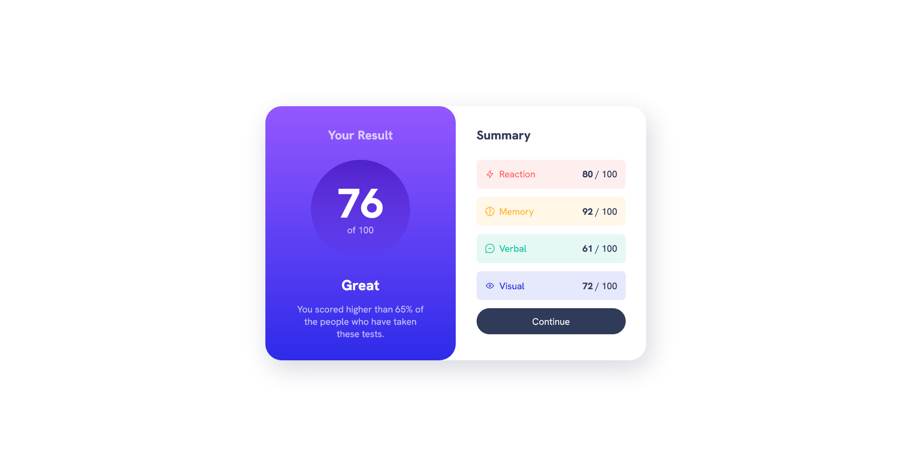

# Results Summary Component

Results summary component that displays an average of a user's test results across various categories.

- Live Site URL: [click here](https://angusgee.github.io/results-summary/)

## Screenshots

|            Desktop view             |                        Mobile view                         |
| :---------------------------------: | :--------------------------------------------------------: |
|  |  |

## Features and Technologies

- **Dynamic Data Loading**: The component fetches data from a JSON file and populates the interface dynamically.
- **Responsive Design**: Adapts fluently to different screen sizes and devices.
- **CSS 3.0**: Use of modern CSS allows use of variables for colours, sizes and even padding make future customisations fast and painless.
- **Fetch API and Promise Chaining**: Data fetched using Fetch API returns a promise, which is then passed to a function to parse the JSON, again returning a promise, which we finally pass to an initialiser function.
- **Modern Array Methods**: We use `array.reduce()` instead of a `for` loop to create and sum an array of the scores using only one line of code.
- **Secure Coding Best Practices**: The image element is added by creating an instance of the Image class and setting the src attribute programmatically. This should prevent XSS (cross-site scripting attacks) if the JSON data contained malicious code.

---

Made with ❤️ by AngusGee. Find me on [GitHub](https://github.com/AngusGee).
